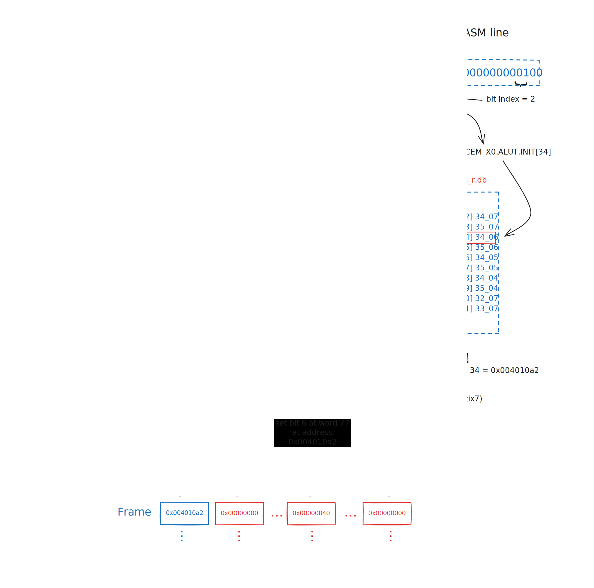

[](https://opensource.org/licenses/Apache-2.0)
[](https://github.com/lromor/fpga-assembler/actions/workflows/ci.yml)

# fpga-assembler

This command-line tool converts [FASM][fasm-spec] files into bitstreams, simplifying the assembly of human-readable FPGA configurations into the binary formats needed to program various FPGAs.

At this stage, it can generate a set of frames in the same manner as [fasm2frames](https://github.com/chipsalliance/f4pga-xc-fasm/blob/25dc605c9c0896204f0c3425b52a332034cf5e5c/xc_fasm/fasm2frames.py).
It has been tested with the Artix-7 [counter example][counter-example], where it produces identical frames—at and a working bitstream at approximately 10 times the speed compared to the pure Python textX based parser implementation.

## Usage

First, install [Bazel][bazel] and ensure you have a basic C/C++ toolchain set up. Then run:

```
bazel run -c opt //fpga:fpga-as -- --prjxray_db_path=/some/path/prjxray-db/artix7 --part=xc7a35tcsg324-1 < /some/path.fasm > output.bit
```

Finally, load the bitstream in your FPGA using [openFPGALoader][open-fpga-loader]

```
openFPGALoader -b arty output.bit
```

## Installation

For installing the binary in your home directory (e.g., ~/bin), run the following command:

```
bazel build -c opt //fpga:fpga-as && install -D --strip bazel-bin/fpga/fpga-as ~/bin/fpga-as
```

or install in system directory that requires root-access:

```
sudo install -D --strip bazel-bin/fpga/fpga-as /usr/local/bin/fpga-as
```

# How it works

## Frames generation


In a FASM file, each line represents a sub-tile feature along with the configuration bits required to enable that feature.
In other words, when a tile feature is enabled, its corresponding configuration bits must also be activated.

The diagram below illustrates the basic process for the `xc7a50t` fabric:



For example, consider the FASM line:
```
CLBLM_R_X33Y38.SLICEM_X0.ALUT.INIT[63:32]=32'b00000000000000000000000000000100
```
This line instructs the system to configure the SLICEM_X0.ALUT.INIT feature of the tile named CLBLM_R_X33Y38, enabling the feature at address 34.

The next step is to locate the tile metadata in the FPGA fabric's `tilegrid.json` file. The metadata provides essential information, including:

* tile_type: `"CLBLM_R"`
* baseaddr: `"0x00401080`
* offset: `77`

Using this metadata, you can search the segbits database for the specific feature. By matching the tile_type and the FASM feature name, you can identify the correct configuration bits in the tile type segbits file (`segbits_clblm_r.db`). In this case, you would look for the entry corresponding to CLBLM_R.SLICEM_X0.ALUT.INIT and find the entry for address `[34]`. The value 34_06 then provides the coordinates for the word index and the specific bit index to be set.

[fasm-spec]: https://fasm.readthedocs.io/en/stable/#
[bazel]: https://bazel.build/
[counter-example]: https://github.com/chipsalliance/f4pga-examples/blob/13f11197b33dae1cde3bf146f317d63f0134eacf/xc7/counter_test/counter.v
[open-fpga-loader]: https://github.com/trabucayre/openFPGALoader
